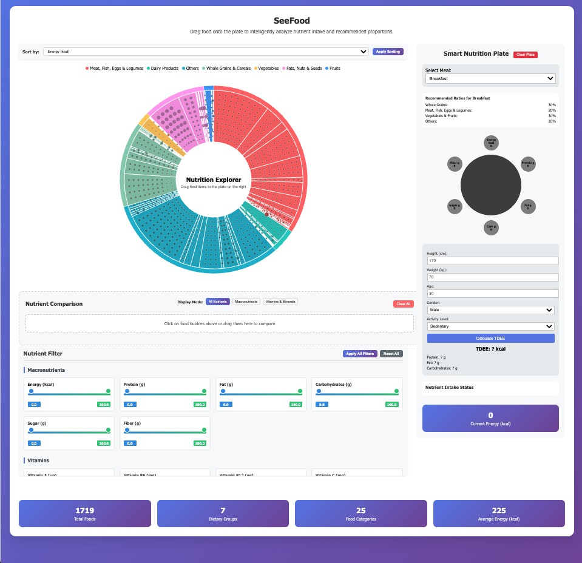
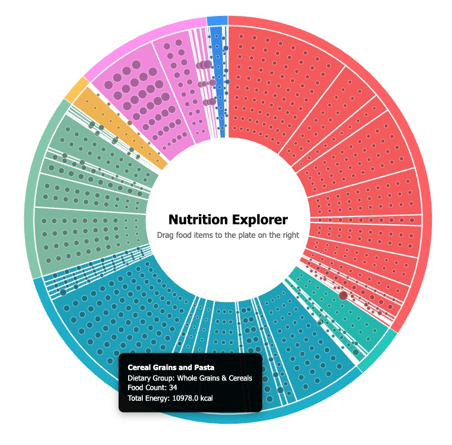
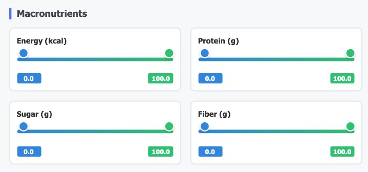
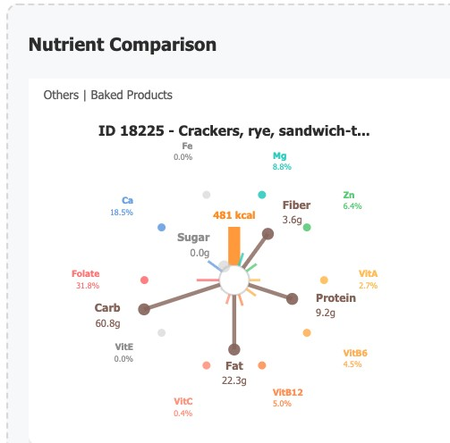
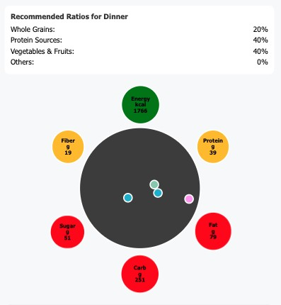
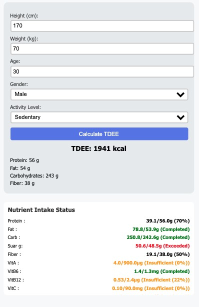

# 113\_2\_visualize

**Team 04 Visualization Final Project**
**SeeFood: Food Nutrition and Calorie Tracking Interactive Visualization System**

---

## System Overview

**SeeFood** (See Your Food 👀) is an interactive food nutrition visualization dashboard. Users can explore both macro and micro nutrition data of various foods, drag items onto a personalized plate to simulate daily intake, and utilize a range of features such as multi-dimensional filtering, nutritional comparison, and TDEE calculation.

---

### 🔗 **Live Demo**

deployed as a static website using GitHub Pages:

[👉 Click here to try it online](https://a1093351.github.io/)

---

## How to Run Locally

1. **Open the main file**
   Use a modern web browser (Chrome recommended) to open `index.html` in your project folder.

2. **If you encounter data loading problems (CORS/browser security issues):**
   Start a local server in the project directory:

   * Using Python 3:

     ```bash
     python -m http.server 8000
     ```
   * Then open `http://localhost:8000` in your browser.

---

## Environment and Libraries

* **Any modern web browser** (e.g., Chrome, Edge, Firefox)
* No backend or Node.js installation required
* Frontend uses [D3.js v6](https://github.com/d3/d3/releases/tag/v6.7.0) for interactive visualizations

---

## Data Files

* Main dataset file:

  * `v2_test_labeled.csv`
  * (Legacy or backup files: `test_labeled.csv`, `test_labeled_new.csv`)
* Data CSV files must be in the same directory as `index.html` to function properly.
* You can download these CSV files directly from this repository.

---

## Features

*General overview of the web system.*
### 1. Nutrition Chart

*Visualizes food data; filterable by different nutrients.*


*Set upper and lower bounds for each nutrient filter.*
* Visualizes nutrient values for each food item as circles sized according to the selected nutrient.
* Filter sliders below the chart allow users to narrow the visible data range for each nutrient.

### 2. One-on-One Comparison Chart


*Displays detailed information for selected data point.*
* Drag food items into this area to view detailed nutritional information.
* Three line types are used:

  * Brown: Major macronutrients (e.g., protein)
  * Blue (top): Minerals
  * Warm colors (bottom): Vitamins

### 3. Personalized Plate


*Plate color changes and warnings based on user selections.*



*Performs nutrition calculation based on personal input.*

* Set your gender, age, weight, height, physical activity, and meal type.
* Calculates your recommended nutrient ranges based on TDEE (Total Daily Energy Expenditure).

#### Additional Features

* Multi-dimensional nutrient filtering (e.g., protein, fat, vitamins)
* Drag-and-drop foods to the plate to dynamically simulate intake and meal balance
* Multiple food comparison
* Automatic TDEE calculation and personalized nutrition advice
* Intuitive color encoding for food categories, rich tooltip interaction

---

## Data Source

* Download the dataset from the [GitHub repository](https://github.com/a1093351/a1093351.github.io) or [direct CSV link](https://github.com/a1093351/a1093351.github.io/raw/main/v2_test_labeled.csv).
* Data is based on the [USDA National Nutrient Database](https://www.kaggle.com/datasets/haithemhermessi/usda-national-nutrient-database?select=train.csv) test set (original source: United States Department of Agriculture).

  * Each record represents the nutrient composition of 100g of a specific food in the US, including calories, protein, and many other nutrients. This dataset is intended to support researchers, policy makers, and consumers in analyzing and predicting the nutritional value of foods. The data has been pre-processed and grouped for applications in food categorization and nutritional analysis.
* The "Diet\_Group" field was automatically labeled using ChatGPT 4o-mini. Details on the labeling prompt can be found in `labeling.py`.

---

## Team Contributions

* **Team 04**

  * M134020001 Ping-Yun Huang（黃品勻）: Interactive Web Components
  * M134020016 Yu-Fu Wang（王予芙）: Plate Module Development
  * M134020019 Liang-Tzu Huang（黃亮慈）: Visualization & Comparison Panel

---

**Professor and TAs,Thank you ! Have a wonderful summer break! 🥳❤️**

---
## PICs

| Screenshot                               | Description (EN)                                   | 說明（中文）                     |
|-------------------------------------------|----------------------------------------------------|-----------------------------------|
|        | **System Overview**<br>Overall view of the web system.         | 系統總覽                          |
|        | **Nutrition Chart**<br>Visualizes food data; filterable by nutrients. | 圖表，可篩選條件進行顯示           |
|      | **Multi-Range Filter Panel**<br>Set upper and lower bounds for nutrients. | 篩選器，可設定上下範圍             |
|    | **Food Item Details**<br>Detailed nutritional info for selected data. | 個別資料點的詳細資訊              |
|    | **Plate with Alerts**<br>Plate color and warnings based on selection. | 餐盤，依據選擇的內容有顏色顯示     |
|  | **Personalized Calculation**<br>Nutrition calculation based on personal input. | 依據個人數值進行個人化計算         |
